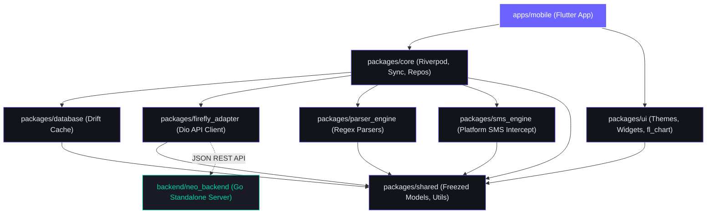
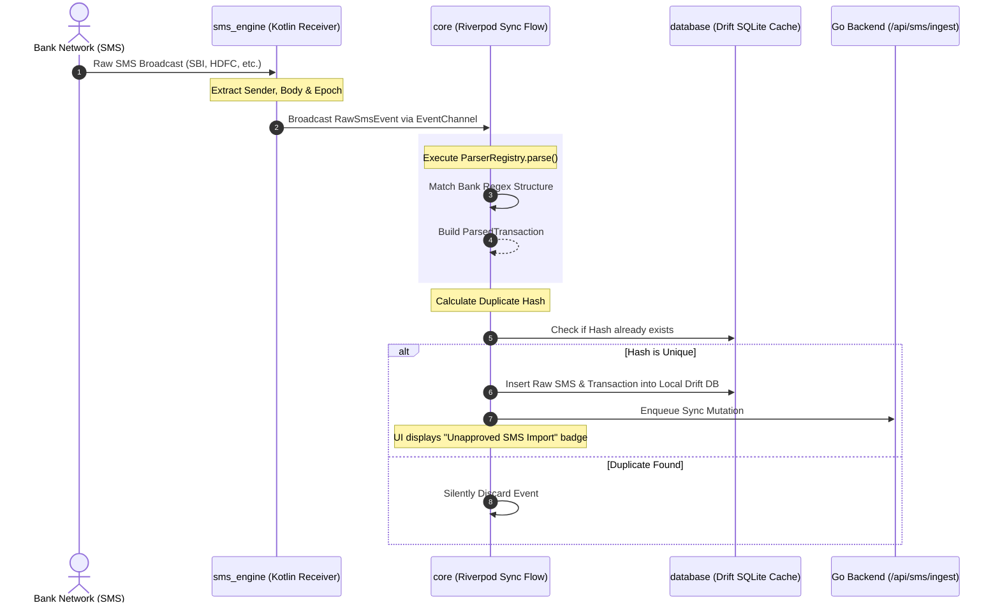
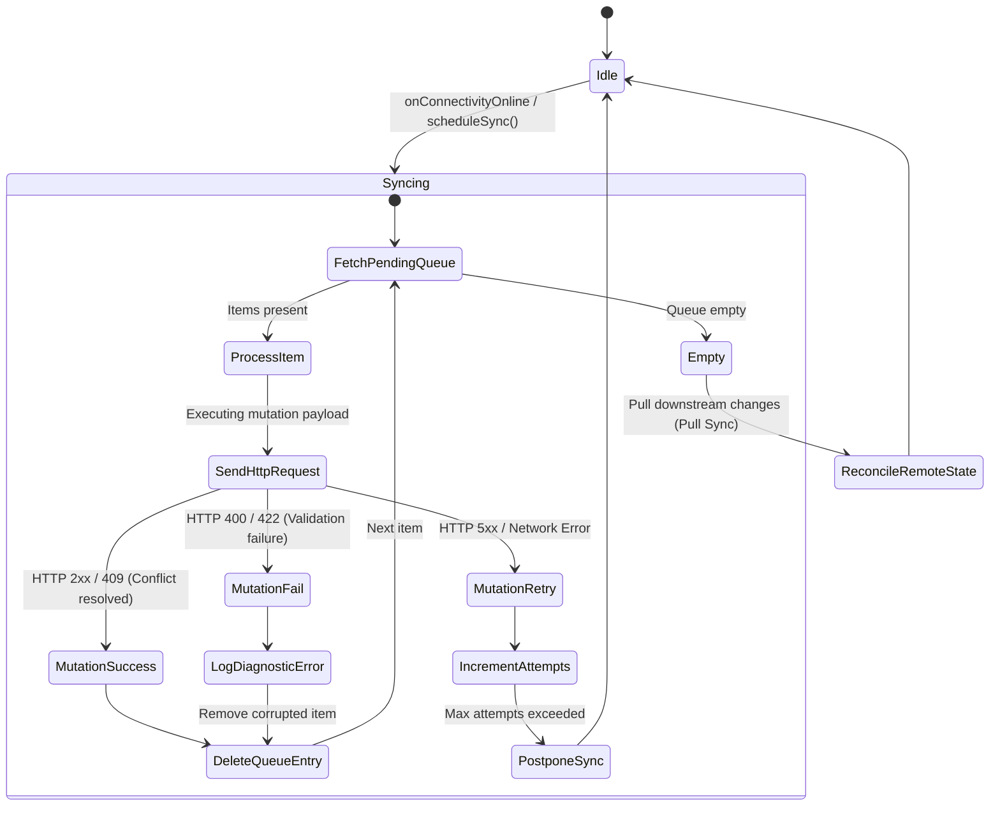

# FireflyIII Neo: Technical Architecture & Onboarding Manual
*Target Audience: Senior Staff & Principal Engineers*

Welcome to the team! **FireflyIII Neo** is a production-grade, local-first personal finance application designed as a modern cross-platform replacement frontend for Firefly III. It is architected for speed, responsiveness, offline resilience, and automated transaction ingestion via native mobile SMS scraping. 

This document serves as your technical map to understanding the codebase, how its modules interlock, and the operational pipelines that make it work.

---

## 1. Architectural Philosophy & Core Axioms

To achieve a premium product feel comparable to *Monarch Money* or *Linear*, we operate under several strict engineering axioms:

1. **Local-First, Offline-Ready**: Every user operation is committed immediately to a local client-side cache and queued asynchronously for backend synchronization. The UI remains fully interactive even during zero-connectivity events.
2. **CGO-Free Embedded Server**: The Go backend is built without CGO to facilitate easy cross-compilation and seamless packaging inside desktop/mobile runtimes. It uses a pure-Go SQLite driver (`modernc.org/sqlite`).
3. **Reactivity via Streams**: The client app utilizes Drift database streams coupled with Flutter Riverpod providers. UI components are reactive observers of the database state, preventing manual imperative UI refreshes.
4. **Modular Monorepo**: All Flutter code is segregated into discrete domain-specific packages inside a Melos-managed monorepo. This maintains strict layer boundaries and prevents circular dependencies.
5. **No Placeholders**: Real, production-quality implementations are used across all packages (e.g., specific regex parsing for real banking institutions rather than generic dummy extractors).

---

## 2. Monorepo Structure

Our project is organized as a monorepo managed with [Melos](file:///d:/Personal_docs/FireflyIIINeo/melos.yaml). The layout separates core runtimes, custom modular packages, developer infrastructure, and continuous integration workflows.

```text
d:\Personal_docs\FireflyIIINeo\
├── .github/                     # Production CI/CD pipelines
│   └── workflows/
│       ├── ci.yml               # Multi-stage testing & compilation pipeline
│       └── release.yml          # Continuous delivery (Go binaries & APK creation)
├── apps/
│   └── mobile/                  # Main Flutter application (glues all packages)
├── backend/
│   └── neo_backend/             # Standalone Go REST API (embedded backend server)
│       ├── go.mod               # Declares Chi, GORM, modernc/sqlite dependencies
│       ├── main.go              # Root entrypoint, DB migration & server lifecycle
│       └── internal/            # Domain sub-packages (auth, db, routers, handlers)
├── docker/                      # Development & production compose configurations
├── doc/
│   └── onboarding_architecture.md # This onboarding documentation
├── packages/                    # Domain-isolated packages
│   ├── shared/                  # Freezed models, API schemas, and core formatters
│   ├── database/                # Drift local DB schemas, indexes, and DAOs
│   ├── firefly_adapter/         # Network client wrapper (Dio + Retrofit concepts)
│   ├── sms_engine/              # Kotlin Foreground Service & MethodChannel layer
│   ├── parser_engine/           # Bank-specific regex parsers (SBI, HDFC, Axis, etc.)
│   ├── ui/                      # Premium theme engine, charts, and glassmorphic UI kit
│   └── core/                    # Riverpod providers, SyncManager, and Repositories
├── melos.yaml                   # Monorepo build orchestrator configuration
└── pubspec.yaml                 # Root workspace pubspec
```

---

## 3. Package Topology & Dependency Graph

To maintain clean architecture, packages have strict visibility hierarchies. 
- Core business logic resides in `core`.
- Raw database models and networking live in `database` and `firefly_adapter`.
- The user interface components in `ui` are agnostic of sync states and remote APIs.

### Visualizing the Dependency Graph



### Dependency Details

| Package | Key Target / Responsibility | Core Dependencies | Key Technologies |
| :--- | :--- | :--- | :--- |
| **`shared`** | Declares standard cross-module data entities, currency formatting, and system-wide API endpoint routing constants. | None | `freezed`, `json_annotation`, `intl` |
| **`database`** | Local sqlite engine schema definitions, custom indices for quick time-series charts, and data access objects (DAOs). | `shared` | `drift`, `drift_flutter`, `path_provider` |
| **`firefly_adapter`** | Low-level network request/response handling. Manages auth tokens, automatic headers, and custom offline request queuing. | `shared` | `dio`, `retrofit`, `pretty_dio_logger` |
| **`sms_engine`** | Handles background processing of SMS feeds via physical channel bindings. Offers file imports (CSV) for desktop platforms. | `shared` | `Kotlin`, `MethodChannel`, `EventChannel` |
| **`parser_engine`** | String tokenizers and regex state machines designed to extract transactions from raw carrier messages. | `shared` | `crypto`, `dart:convert` |
| **`ui`** | Implements the brand visual system (Dark glassmorphic designs, Electric violet colors, custom charts, premium micro-animations). | `shared` | `google_fonts`, `fl_chart`, `shimmer`, `lottie` |
| **`core`** | Integrates all sub-systems. Houses the Sync engine state machine, secure storage hooks, local repositories, and Riverpod state. | `database`, `firefly_adapter`, `parser_engine`, `sms_engine`, `shared` | `flutter_riverpod`, `connectivity_plus`, `flutter_secure_storage` |
| **`apps/mobile`** | App entrypoint (`main.dart`). Configures dependency injection containers and maps GoRouter endpoints to visual page flows. | `core`, `ui` | `go_router` |

---

## 4. The Go Embedded Backend Architecture

Our Go backend (`backend/neo_backend`) represents a standalone accounting engine executing locally. In production, this binary is spun up on a daemonized thread by the native desktop shell or mobile environment.

```text
backend/neo_backend/
├── main.go                        # Startup flags, db path config, server loop
└── internal/
    ├── database/
    │   └── database.go            # GORM initialization via modernc.org/sqlite
    ├── models/
    │   └── models.go              # Database model schema (User, Transaction, etc.)
    ├── auth/
    │   └── auth.go                # bcrypt hashing, JWT issuance and PIN verification
    ├── middleware/
    │   └── auth.go                # Bearer extraction & claims validation filters
    ├── router/
    │   └── router.go              # Mounts routes under Chi router context
    └── handlers/
        ├── auth_handler.go        # Handles authentication requests
        ├── accounts_handler.go    # CRUD operations for Asset/Expense accounts
        ├── transactions_handler.go# Query engine with advanced paging/filtering
        ├── categories_handler.go  # Custom categorization endpoints
        ├── rules_handler.go       # Rules engine (matches transaction conditions)
        ├── sms_handler.go         # Direct SMS ingestion, approvals & duplicate detection
        └── analytics_handler.go   # Net-worth, monthly cashflow & category trends
```

### Database Subsystem (No CGO)
To achieve zero compile dependencies, standard CGO compilers are bypassed. Instead, we use `modernc.org/sqlite` bound to GORM:

```go
// From internal/database/database.go
import (
    "gorm.io/driver/sqlite"
    "gorm.io/gorm"
    _ "modernc.org/sqlite" // Pure Go SQLite driver registration
)

func OpenDB(dbPath string) (*gorm.DB, error) {
    // Configures modernc driver through standard gorm interface
    return gorm.Open(sqlite.Open(dbPath), &gorm.Config{})
}
```

### Handler Design & Business Logic Layer
Every GORM model inside `internal/models/models.go` aligns perfectly with standard JSON serialization interfaces.
- **Rule Engine Handler (`internal/handlers/rules_handler.go`)**: Evaluates transaction structs against user-defined regexes or text match criteria, performing automated transformations (e.g. automatically assigning a Category ID or Tag on import).
- **Analytics Engine (`internal/handlers/analytics_handler.go`)**: Offloads heavy statistical queries from the mobile client. It generates monthly time-series intervals for Cashflow, calculates Net Worth by tracking asset vs liability aggregates, and evaluates Category breakdowns using optimized GORM queries.

---

## 5. SMS Ingestion & Transaction Matching Pipeline

This is the most critical pipeline in the application. It acts as an automated bridge between system-level broadcasts and structured backend records.

### The Ingestion Sequence



### Deep Dive: Deduplication & Hash Strategy
SMS notifications can arrive multiple times (network retries, SIM dual-reception, manual resyncs). To prevent transaction duplication, `parser_engine` calculates a deterministic hash (`duplicateHash`):

```dart
// From packages/parser_engine/lib/src/base_parser.dart
String generateHash(ParsedTransaction tx) {
  // Buckets timestamp to the nearest minute to avoid small delivery delay offsets
  final minuteBucket = tx.timestamp.millisecondsSinceEpoch ~/ 60000;
  final input = '${tx.amount}|${tx.merchant}|${minuteBucket}';
  return sha256.convert(utf8.encode(input)).toString().substring(0, 16);
}
```

---

## 6. Offline-First Sync Architecture

Our sync mechanism is built for offline resilience. The design models all client mutations as event payloads stored in a write-ahead log table inside SQLite before sending them to the Go backend.

### Database Sync Schema

We track pending synchronization work using the `SyncQueueTable` in `database`:

```dart
// From packages/database/lib/src/tables/sync_queue_table.dart
class SyncQueueTable extends Table {
  IntColumn get id => integer().autoIncrement()();
  TextColumn get operation => text()();      // 'create', 'update', 'delete'
  TextColumn get resource => text()();       // 'transaction', 'account', 'category'
  TextColumn get resourceId => text()();     // Domain UUID
  TextColumn get payload => text()();        // Serialized JSON of mutation state
  IntColumn get attempts => integer().withDefault(const Constant(0))();
  DateTimeColumn get lastAttempt => dateTime().nullable()();
  DateTimeColumn get createdAt => dateTime().withDefault(currentDateAndTime)();
}
```

### Sync State Machine
The core sync loop resides in `SyncManager` inside `core`:



### Conflict Resolution Strategy
When processing operations sequentially:
1. **Creation Conflicts**: If the client retries a transaction creation but the server already has it (e.g. initial request succeeded but response timed out), the Go backend returns `409 Conflict`. The client interprets this as success and deletes the local queue entry.
2. **Sequential Integrity**: All queue modifications use **Strict FIFO ordering** scoped per resource ID to prevent an update operation from executing before a creation operation.

---

## 7. State Management & Reactivity

We use a combination of Riverpod and Drift to manage application state. By feeding Drift's SQL streams directly into Riverpod's reactive architecture, we create a high-performance system that updates automatically when data changes.

### UI Reactivity Pattern

```text
 Drift Database               Riverpod Providers           UI Widgets
┌────────────────┐           ┌────────────────────┐       ┌────────────────────┐
│ SQLite State   │           │ watchAccounts      │       │ ConsumerWidget     │
│                │ ────────> │                    │ ────> │                    │
│   [Drift DB]   │ (Streams) │  [StreamProvider]  │       │  [AccountList]     │
└────────────────┘           └────────────────────┘       └────────────────────┘
        ▲                                                           │
        │                                                           │
        │ (Mutation / Event)                                        │
        │                                                           ▼
┌─────────────────────────────────────────────────┐       ┌────────────────────┐
│ Repositories / Core Layer                       │ <──── │ Button Interaction │
│   - Enqueues to local DB                        │ (Tap) │                    │
│   - Schedules sync event                        │       │  [Click Transfer]  │
└─────────────────────────────────────────────────┘       └────────────────────┘
```

By ensuring that the UI only observes database streams, we completely avoid manual state-sync bugs. When a background SMS is parsed and written to the database, the Drift stream automatically fires, propagating the change through Riverpod to re-render the UI instantly.

---

## 8. Development & Onboarding Playbook

### Prerequisite Checklist
Make sure you have these installed on your local workstation:
- Go Toolchain (`>= 1.22`)
- Flutter SDK (`>= 3.22.0`)
- Android Studio / Xcode (depending on your mobile target)
- Melos (`dart pub global activate melos`)

### 1. Monorepo Setup & Bootstrapping
Clone the workspace and run melos to link all packages:
```powershell
# Installs dependencies across all packages and symlinks cross-package references
melos bootstrap
```

### 2. Generate Generated Code (Freezed & Drift)
We rely heavily on generated code for models and database adapters. Run the build runner workspace-wide:
```powershell
# Executes build_runner for all dependent packages in parallel
melos run gen
```

### 3. Running the Go Backend Standalone
You can launch the embedded backend locally for debugging APIs:
```powershell
cd backend/neo_backend
go mod tidy
go run main.go --port 9090 --db-path ./local_neo.db
```

### 4. Running the Flutter App
Launch the Flutter mobile shell (ensure your emulator is running or device is connected):
```powershell
cd apps/mobile
flutter run
```

### 5. Running Code Quality Suites
Always ensure the codebase remains clean before pushing your commits:
```powershell
# Run codebase analyzer
melos run analyze

# Run unit and widget test suites
melos run test
```

---

## 9. Key Performance Design Patterns

As a senior engineer, please keep these architecture points in mind when adding features:

1. **Avoid N+1 Database Queries**: When displaying transactions with category profiles, utilize SQLite joins. Avoid iterating over a transaction list and running single `getCategoryById` queries inside widgets.
2. **Optimize UI Paint Passes**: Keep UI cards modular. Use `const` constructor instances and granular Riverpod observers (`select`) to prevent large parent page trees from rebuilding when only one balance changes.
3. **Handle Big Numbers Safely**: All monetary calculations are handled as `double` values on the client side, but they must be rounded to two decimal places at calculation boundaries to prevent floating-point precision issues.
4. **Android Foreground Service Limits**: Android 14+ enforces strict background execution rules. The Kotlin receiver in `sms_engine` runs as an explicit foreground service (`FOREGROUND_SERVICE_DATA_SYNC`) accompanied by a persistent notification to prevent OS teardowns.

Again, welcome aboard! If you have any architectural questions, please reach out to the core repository maintainers. Let's build a beautiful, offline-first personal finance experience!
